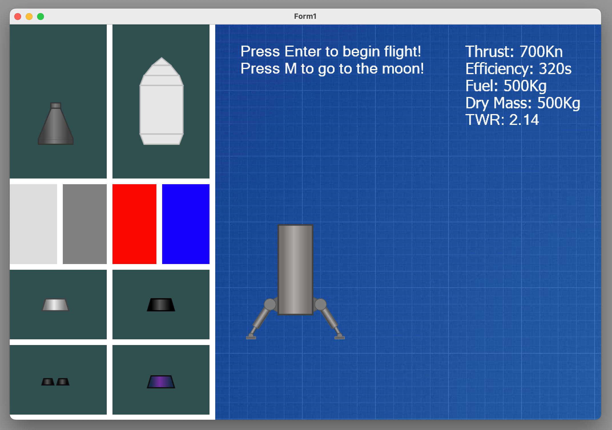
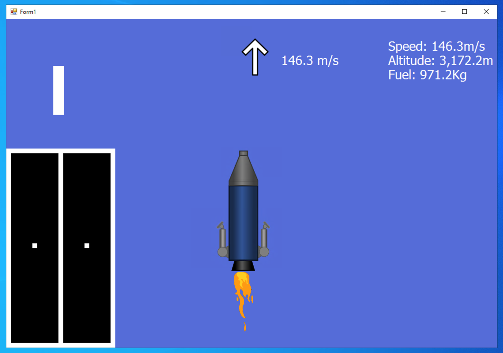
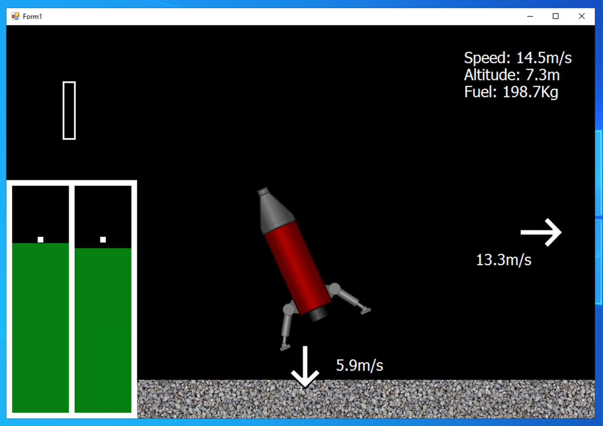

# ICS4U-Rocket

This is a Windows Forms application I built as my final project for ICS4U (Grade 12 Computer Science).

It simulates basic rocket behavior using C#. The interface is built using WinForms and includes custom logic for atmospheric flight, on-orbit maneuvering, and docking through simple keyboard controls.

## Project Info

- **Created:** 2022
- **Language:** C#
- **Tools:** Visual Studio, WinForms

